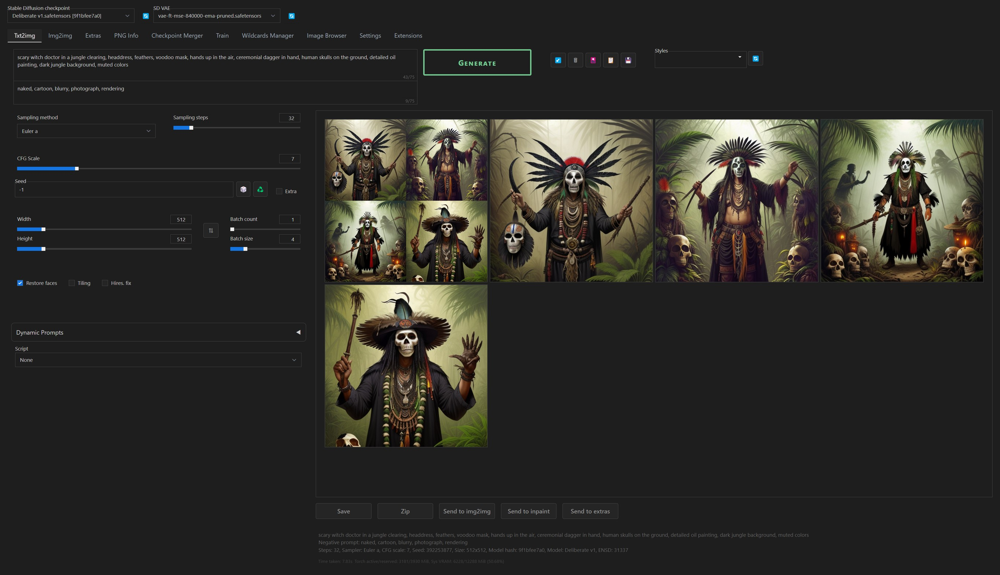

# Dark Diffusion

A simple dark theme for [Stable Diffusion WebUI](https://github.com/AUTOMATIC1111/stable-diffusion-webui). Designed to declutter the interface to focus attention on the image content. Developed for Chrome & Windows 11 on a 4k resolution.

## Installation

Copy `user.css` to the root directory of your [stable-diffusion-webui](https://github.com/AUTOMATIC1111/stable-diffusion-webui) installation.

Launch your WebUI with argument `--theme=dark`. For example, on Windows your `webui-user.bat` should include:

    set COMMANDLINE_ARGS= --theme=dark

## Known issues / work-in-progress

- Interrupt/Skip button have red color but blue border
- When server loads something, dark blue curtains appear momentarily (e.g. over checkpoint selection, over prompts) to disable user input.
- When tokens are being counted, an unstyled word "Loading" appears in the upper-right of a text prompt window.

## Acknowledgements

[Dark-Themes-SD-WebUI-Automatic1111](https://github.com/Nacurutu/Dark-Themes-SD-WebUI-Automatic1111) used as a starting point for this theme.
